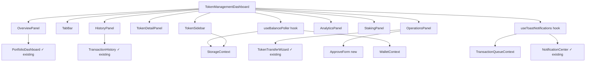

# Design Document: Token Management Dashboard

## Overview

The Token Management Dashboard is a unified React shell component (`TokenManagementDashboard`) that composes the existing `PortfolioDashboard`, `TransactionHistory`, and `TokenTransferWizard` components with new panels for token detail, allowance management, staking, and real-time balance polling. It is scoped to the Soroban (Stellar) blockchain context and integrates with the existing `StorageContext`, `TransactionQueueContext`, `WalletContext`, and `NotificationCenter`.

The dashboard follows a master-detail layout: a left sidebar lists the user's tokens; selecting a token loads its detail panel on the right. A top-level tab bar switches between Overview, History, Operations, Analytics, and Staking views.

### Key Design Decisions

- **No new routing library**: navigation between panels is managed with local React state (`selectedTokenId`, `activeTab`) to avoid adding a router dependency.
- **No charting library**: all charts (donut, sparkline, bar) reuse the existing SVG implementations inside `PortfolioDashboard`. New charts follow the same inline-SVG pattern.
- **Polling via `useInterval` hook**: a lightweight custom hook wraps `setInterval` and respects `document.visibilityState` to pause when the tab is hidden, satisfying Requirement 5.
- **`fast-check` for property tests**: already a dev dependency; used for all property-based tests.
- **CSV export**: reuses the existing `exportCSV` helper pattern from `PortfolioDashboard` and `TransactionHistory`.

---

## Architecture



The dashboard is a **pure React component tree** — no Redux, no new context providers. All shared state lives in the existing contexts. The only new stateful primitives are:

| Hook / Service | Responsibility |
|---|---|
| `useBalancePoller` | Periodic RPC refresh, visibility-aware pause |
| `useToastNotifications` | Watch transaction status changes, fire toasts |
| `useTokenMetadata` | Fetch token name/symbol/decimals/supply from RPC |
| `useAllowances` | Fetch active allowances for the connected wallet |

---

## Components and Interfaces

### `TokenManagementDashboard` (root)

```tsx
interface TokenManagementDashboardProps {
  /** Soroban RPC endpoint, defaults to env var */
  rpcUrl?: string;
  /** Polling interval in ms, default 30_000 */
  pollIntervalMs?: number;
}
```

Internal state:
```ts
type Tab = 'overview' | 'history' | 'operations' | 'analytics' | 'staking';
const [selectedTokenId, setSelectedTokenId] = useState<string | null>(null);
const [activeTab, setActiveTab] = useState<Tab>('overview');
```

### `TokenSidebar`

Renders the list of `Balance` records from `StorageContext`. Each row shows symbol, display amount, and fiat value. Clicking a row sets `selectedTokenId`.

```tsx
interface TokenSidebarProps {
  balances: Balance[];
  selectedId: string | null;
  onSelect: (contractId: string) => void;
  currency: string;
}
```

### `TokenDetailPanel`

Displays metadata for the selected token. Fetches from RPC via `useTokenMetadata`. Shows a copy-to-clipboard button for the contract ID.

```tsx
interface TokenDetailPanelProps {
  contractId: string;
  walletAddress: string;
  rpcUrl: string;
}
```

### `ApproveForm`

New component for setting allowances. Validates spender address and amount before calling `createTransaction('approve', ...)`.

```tsx
interface ApproveFormProps {
  contractId: string;
  onSuccess: (txId: string) => void;
}
```

### `StakingPanel`

Shown only when `stakingContractAddress` is configured for the selected token. Displays staked balance, estimated rewards, lock-up period, and stake/unstake forms.

```tsx
interface StakingPanelProps {
  tokenContractId: string;
  stakingContractAddress: string;
  walletAddress: string;
  rpcUrl: string;
}
```

### `useBalancePoller`

```ts
function useBalancePoller(opts: {
  walletAddress: string | null;
  contractIds: string[];
  rpcUrl: string;
  intervalMs: number;
  onBalanceChange: (contractId: string, newAmount: string, oldAmount: string) => void;
}): { lastUpdated: number | null; error: string | null }
```

Internally uses `useInterval` (pauses when `document.hidden`) and calls the Soroban RPC `getLedgerEntries` to read token balances, then calls `StorageContext.saveBalance` when a change is detected.

### `useToastNotifications`

```ts
function useToastNotifications(transactions: CachedTransaction[]): void
```

Watches `transactions` for status transitions to `synced` or `failed` and fires `notificationManager.createNotification(...)`.

---

## Data Models

### Existing models (unchanged)

```ts
// From src/services/storage/types.ts
interface Balance {
  id: string;
  address: string;
  contractId: string;
  tokenSymbol: string;
  amount: string;           // in stroops
  lastUpdated: number;
  previousAmount?: string;  // used for P&L and sparkline
  previousUpdated?: number;
  fiatRates?: Record<string, number>;
  alertThreshold?: number;
}

interface CachedTransaction {
  id: string;
  type: TransactionType;    // 'transfer' | 'mint' | 'burn' | 'approve' | ...
  contractId: string;
  method: string;
  params: Record<string, unknown>;
  status: TransactionStatus; // 'pending' | 'syncing' | 'synced' | 'failed' | 'conflict'
  createdAt: number;
  syncedAt?: number;
  error?: string;
  retryCount: number;
}
```

### New models

```ts
/** Fetched from Soroban RPC, not persisted */
interface TokenMetadata {
  contractId: string;
  name: string;
  symbol: string;
  decimals: number;
  totalSupply: string; // in stroops
}

/** Fetched from Soroban RPC, not persisted */
interface Allowance {
  owner: string;
  spender: string;
  amount: string;       // in stroops
  expirationLedger: number;
}

/** Staking state fetched from staking contract, not persisted */
interface StakingState {
  stakedAmount: string;   // in stroops
  estimatedRewards: string;
  lockupEndsAt: number;   // unix ms
}

/** Token config — stored in localStorage keyed by contractId */
interface TokenConfig {
  contractId: string;
  stakingContractAddress?: string;
}
```

### Staking contract address configuration

Token configs are stored in `localStorage` under the key `tmd_token_configs` as a JSON array of `TokenConfig`. The dashboard provides a settings UI to add/remove staking contract addresses per token.

---

## Correctness Properties

*A property is a characteristic or behavior that should hold true across all valid executions of a system — essentially, a formal statement about what the system should do. Properties serve as the bridge between human-readable specifications and machine-verifiable correctness guarantees.*

### Property 1: Portfolio fiat total is the sum of individual token fiat values

*For any* non-empty list of `Balance` records and a fiat currency, the total portfolio value displayed by the dashboard should equal the sum of `(toFloat(balance.amount) * (balance.fiatRates?.[currency] ?? 0))` across all balances.

**Validates: Requirements 1.2**

---

### Property 2: Portfolio summary contains every token's symbol and balance

*For any* list of `Balance` records, the rendered portfolio summary should contain each token's `tokenSymbol` and a formatted representation of its `amount`.

**Validates: Requirements 1.1**

---

### Property 3: Poller calls refresh at the configured interval when tab is visible

*For any* configured poll interval and list of contract IDs, the balance refresh callback should be called approximately `floor(elapsed / interval)` times during a period when `document.hidden` is false.

**Validates: Requirements 5.1**

---

### Property 4: Poller does not call refresh when tab is hidden

*For any* configured poll interval, if `document.hidden` is true throughout a polling period, the balance refresh callback should never be called.

**Validates: Requirements 5.2**

---

### Property 5: Balance change detection triggers onBalanceChange callback

*For any* pair of consecutive poll results where the new amount differs from the stored amount, the `onBalanceChange` callback should be called with the correct `contractId`, `newAmount`, and `oldAmount`.

**Validates: Requirements 5.3**

---

### Property 6: Transaction status transition to synced or failed fires a toast

*For any* `CachedTransaction` whose status transitions from a non-terminal state to `synced` or `failed`, `useToastNotifications` should call `notificationManager.createNotification` exactly once with the transaction type and final status.

**Validates: Requirements 5.4**

---

### Property 7: Transaction filter returns only matching transactions

*For any* list of `CachedTransaction` records and a filter configuration (search term, type set, status set), every transaction in the filtered result should satisfy all active filter predicates, and no matching transaction should be excluded.

**Validates: Requirements 3.2, 3.3**

---

### Property 8: Transaction sort produces a correctly ordered list

*For any* list of `CachedTransaction` records and a sort configuration (field, direction), the sorted result should be a permutation of the input where adjacent elements satisfy the ordering relation.

**Validates: Requirements 3.4**

---

### Property 9: CSV export round-trip preserves transaction data

*For any* list of `CachedTransaction` records, parsing the CSV produced by `exportCSV` should yield rows whose fields match the original transaction's `id`, `type`, `status`, `contractId`, and `method`.

**Validates: Requirements 3.6**

---

### Property 10: Stellar address validator accepts exactly the correct format

*For any* string, `isValidStellarAddress` should return `true` if and only if the string matches `/^G[A-Z2-7]{55}$/`. This covers both transfer recipient validation and approval spender validation.

**Validates: Requirements 4.2, 4.5**

---

### Property 11: Insufficient-balance check rejects amount + fee > available balance

*For any* available balance (in stroops) and transfer amount (in stroops), the balance validator should return an error if and only if `amount + ESTIMATED_FEE_STROOPS > availableBalance`.

**Validates: Requirements 4.3**

---

### Property 12: Staking amount validator rejects out-of-range amounts

*For any* stake or unstake operation, the validator should reject amounts ≤ 0 and amounts exceeding the relevant ceiling (available balance for stake, staked balance for unstake), and accept all amounts in `(0, ceiling]`.

**Validates: Requirements 7.2, 7.3**

---

### Property 13: P&L per token equals (current − previous) × fiatRate

*For any* `Balance` record with `previousAmount` and a `fiatRates` entry, the computed P&L should equal `(toFloat(amount) - toFloat(previousAmount)) * fiatRates[currency]`.

**Validates: Requirements 6.2**

---

### Property 14: Diversification score is in [0, 100] and reflects HHI

*For any* non-empty list of token balances, the diversification score should be in the range `[0, 100]` and equal `Math.round((1 - hhi) * 100)` where `hhi = sum((balance / total)^2)`.

**Validates: Requirements 6.4**

---

### Property 15: Analytics time-range filter excludes out-of-range transactions

*For any* list of `CachedTransaction` records and a selected time range (`7d`, `30d`, `all`), every transaction in the filtered analytics result should have `createdAt >= cutoff`, and no in-range transaction should be excluded.

**Validates: Requirements 6.5**

---

### Property 16: Transaction history is scoped to the selected token's contract ID

*For any* list of `CachedTransaction` records and a selected `contractId`, the transactions passed to `TransactionHistory` should contain only those whose `contractId` matches the selected token.

**Validates: Requirements 3.1**

---

### Property 17: lastUpdated timestamp advances after each successful poll

*For any* sequence of successful poll completions, the `lastUpdated` value returned by `useBalancePoller` should be greater than or equal to the timestamp of the most recent poll.

**Validates: Requirements 5.6**

---

### Property 18: Analytics CSV export contains required columns for all balances

*For any* list of `Balance` records, the CSV produced by the analytics export function should contain a row for each balance with non-empty `symbol`, `balance`, `fiatValue`, and `percentageChange` columns.

**Validates: Requirements 6.6**

---

## Error Handling

| Scenario | Behaviour |
|---|---|
| Soroban RPC unreachable during poll | `useBalancePoller` catches the error, logs it, sets `error` state, and retries at the next interval. The dashboard shows a non-blocking error banner. |
| Token metadata fetch fails | `useTokenMetadata` sets `error` state; `TokenDetailPanel` renders an error message and a "Retry" button that re-triggers the fetch. |
| `createTransaction` throws | The calling form (transfer, approve, stake/unstake) catches the error and displays it inline. The user can retry without losing form state. |
| Empty wallet (no balances) | `TokenSidebar` renders an empty-state prompt. The Overview tab shows the `PortfolioDashboard` empty state. |
| Invalid Stellar address input | Inline validation error shown immediately on blur; form submission is blocked. |
| Staking contract not configured | `StakingPanel` is not rendered; the Staking tab is hidden from the tab bar. |
| `document.visibilitychange` fires while a poll is in-flight | The in-flight request completes normally; subsequent polls are paused until the tab becomes visible again. |

---

## Testing Strategy

### Dual Testing Approach

Both unit tests and property-based tests are required. Unit tests cover specific examples, edge cases, and integration points. Property tests verify universal correctness across randomised inputs.

### Unit Tests

Focus areas:
- `TokenManagementDashboard` renders without crashing with empty storage
- Empty-state message appears when `balances` is `[]` (Requirement 1.3)
- `TokenDetailPanel` shows error message and retry button when RPC throws (Requirement 2.4)
- Copy-to-clipboard button is present for any contract ID (Requirement 2.5)
- "No results" message appears when all filters exclude all transactions (Requirement 3.5)
- `ApproveForm` shows queue error when `createTransaction` rejects (Requirement 4.6)
- Poller logs error and continues when RPC is unreachable (Requirement 5.5)
- `StakingPanel` is hidden when no staking contract is configured (Requirement 7.4)
- Staking confirmation message contains the queued transaction ID (Requirement 7.5)
- `StakingPanel` is rendered with correct data when staking contract is configured (Requirement 7.1)

### Property-Based Tests

Library: **`fast-check`** (already a dev dependency).

Each property test runs a minimum of **100 iterations**.

Each test is tagged with a comment in the format:
`// Feature: token-management-dashboard, Property N: <property_text>`

| Property | Test description |
|---|---|
| P1 | Generate random `Balance[]` + currency; assert `computeTotalFiat(balances, currency)` equals manual sum |
| P2 | Generate random `Balance[]`; render summary; assert each `tokenSymbol` appears in output |
| P3 | Mock `setInterval`; assert callback call count matches `floor(elapsed / interval)` for random intervals |
| P4 | Set `document.hidden = true`; assert callback never called across random elapsed times |
| P5 | Generate random old/new balance pairs; assert `onBalanceChange` called iff amounts differ |
| P6 | Generate random `CachedTransaction[]` with status transitions; assert notification fired for `synced`/`failed` only |
| P7 | Generate random `CachedTransaction[]` + filter config; assert all results satisfy predicates and no match is excluded |
| P8 | Generate random `CachedTransaction[]` + sort config; assert result is sorted permutation of input |
| P9 | Generate random `CachedTransaction[]`; export CSV; parse CSV; assert fields match originals |
| P10 | Generate random strings including valid/invalid Stellar addresses; assert validator matches regex exactly |
| P11 | Generate random `(available, amount)` pairs; assert error iff `amount + fee > available` |
| P12 | Generate random `(amount, ceiling)` pairs; assert validator rejects `amount <= 0` or `amount > ceiling` |
| P13 | Generate random `Balance` with `previousAmount` and `fiatRates`; assert P&L equals formula |
| P14 | Generate random balance arrays; assert diversification score in `[0, 100]` and equals HHI formula |
| P15 | Generate random `CachedTransaction[]` + time range; assert all results have `createdAt >= cutoff` |
| P16 | Generate random `CachedTransaction[]` + `contractId`; assert scoped list contains only matching contract |
| P17 | Simulate poll sequence; assert `lastUpdated` is non-decreasing |
| P18 | Generate random `Balance[]`; export analytics CSV; assert each row has all required columns |

### Test file locations

```
src/tests/components/TokenManagementDashboard.test.tsx   ← unit tests
src/tests/components/TokenManagementDashboard.pbt.test.ts ← property tests
src/tests/hooks/useBalancePoller.test.ts                  ← unit + property tests
src/tests/hooks/useToastNotifications.test.ts             ← unit + property tests
src/tests/utils/tokenValidation.test.ts                   ← unit + property tests
src/tests/utils/analyticsCompute.test.ts                  ← unit + property tests
```
